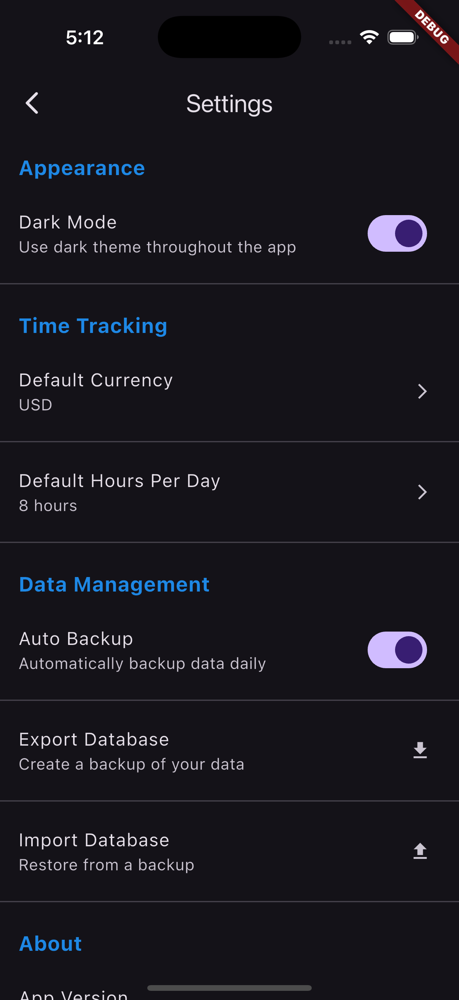

# Billable - Time Tracking App

Billable is a powerful yet simple time tracking application built with Flutter. It helps freelancers, consultants, and professionals track their billable hours, manage clients, projects, and tasks, and generate reports for invoicing.


## Features

### Time Tracking
- **Track Time Entries**: Log hours spent on tasks with client, project, and task details
- **Billable/Non-billable**: Mark entries as billable or non-billable
- **Submission Status**: Track which time entries have been submitted for invoicing
- **Notes**: Add detailed notes to each time entry


### Client, Project, and Task Management
- **Hierarchical Organization**: Structure your work with clients, projects, and tasks
- **Client Details**: Store contact information, addresses, and notes for each client
- **Project Settings**: Configure hourly rates and active status for projects

### Reporting and Analytics
- **Time Summaries**: View total hours by day, week, month, or custom date range
- **Earning Projections**: Calculate potential earnings based on hourly rates
- **Data Export**: Export time entries as CSV files for use in other systems


### Settings and Preferences
- **Dark Mode**: Toggle between light and dark themes
- **Default Currency**: Set your preferred currency for rate calculations
- **Default Hours**: Configure your standard working day length
- **Data Backup**: Export and import your database for safekeeping




## Getting Started

### Installation

Download and install the latest version from the releases section or build from source:

```bash
git clone https://github.com/NRB13/billable.git
cd billable
flutter pub get
flutter run
```

### First Steps

1. **Add Clients**: Start by adding your clients in the settings
2. **Create Projects**: Add projects for each client
3. **Define Tasks**: Create common tasks for your projects
4. **Log Your First Entry**: Use the + button to record your first time entry

## App Workflow

1. **Home Screen**: View all your time entries, filter by month, or use the search feature
2. **Add Entry**: Tap the + button to add a new time entry
3. **Statistics**: Access reports and graphs from the statistics icon
4. **Export**: Generate CSV reports from the export icon
5. **Settings**: Configure app preferences and manage database

## Data Structure

The app organizes your time tracking with:
- **Clients**: The companies or individuals you work for
- **Projects**: Specific engagements or contracts for each client
- **Tasks**: Individual activities or work units within a project
- **Time Entries**: The actual time records with hours and dates

## Database Management

- **Auto Migration**: Database schema updates automatically with app updates
- **Data Preservation**: Your data is preserved during updates
- **Backup/Restore**: Export your database for backup or import to transfer to a new device

## Database Migration Strategy

This app uses SQLite for local data storage with a versioned migration system to ensure users can update the app without losing their data.

### How Database Versioning Works

1. **Version Control**: The database version is defined in `DatabaseService` class as `_databaseVersion`. This number is increased whenever the database schema changes.

2. **Automatic Migrations**: When a user updates the app and the database version increases, the system automatically detects this and runs the appropriate migration code in the `_upgradeDatabase` method.

3. **Data Preservation**: All migrations are designed to preserve existing user data while adding new tables, columns, or restructuring as needed.

### For Developers

When making changes to the database schema:

1. **Increase Version Number**: Increment the `_databaseVersion` constant in `DatabaseService`.

2. **Add Migration Logic**: Create a new migration method (like `_upgradeToVX`) and add the corresponding condition in `_upgradeDatabase`.

3. **Test Thoroughly**: Test the migration with existing data to ensure nothing is lost.

Example of adding a new version:

```dart
// Increase version number
static const int _databaseVersion = 3;  // Was 2 before

// Add migration code
Future<void> _upgradeDatabase(Database db, int oldVersion, int newVersion) async {
  if (oldVersion < 2) {
    await _upgradeToV2(db);
  }
  
  // New migration for version 3
  if (oldVersion < 3) {
    await _upgradeToV3(db);
  }
}

// New migration method
Future<void> _upgradeToV3(Database db) async {
  // Add new tables or columns here
  await db.execute('''
    ALTER TABLE projects ADD COLUMN deadline TEXT
  ''');
  // ... other changes
}
```

### For Users

- **Automatic Process**: Database migrations happen automatically when you update the app.
- **Backup Recommended**: While migrations are designed to preserve data, it's always a good idea to export your database before updating (using the Export Database feature in Settings).
- **In Case of Issues**: If you encounter any problems after updating, you can restore your database from a backup using the Import Database feature.

## Contributing

Contributions are welcome! Please feel free to submit a Pull Request.

## License

This project is licensed under the MIT License - see the LICENSE file for details.

## Acknowledgments

- Built with Flutter and Dart
- Uses SQFlite for local database storage
- Implements Material Design principles

---

*Developed with ❤️ for freelancers and professionals who value their time.*

## Deployment Instructions

### Building for iOS

```bash
# Build the app
flutter build ios

# Open in Xcode
open ios/Runner.xcworkspace
```

In Xcode:
1. Connect your iPhone
2. Select your device from the device dropdown
3. Sign the app with your Apple developer account
4. Click the play button to build and run

### Building for Android

```bash
# Build an APK
flutter build apk

# Install directly to a connected device
flutter install
```

The APK file will be available at: `build/app/outputs/flutter-apk/app-release.apk`

## Getting Started with Development

```bash
# Get dependencies
flutter pub get

# Run the app in debug mode
flutter run
